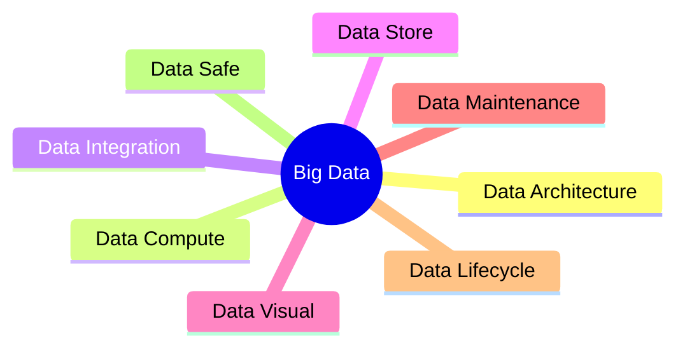

> [!column]
>> [!tabler] Data Architecture
>> - [[Kappa Architecture]] 
>> - [[Lambda Architecture]]
>> - [[ZooKeeper]] 
>>
>
>> [!objectif] Data Compute
>>- [[Apache Flink]]
>>- [[Apache Spark]]
>>- [[Apache Storm]]
>
>> [!objectif] Data Integration
>>- [[Apache Airflow]]
>>- [[Apache Flume]]
>>- [[Apache Kafka]]
>>- [[Apache Pulsar]]
>>- [[Apache Nifi]]
>>- [[DataX]]
>>- [[Apache DolphinScheduler]]
>>- [[chunjun]]
>
>
>> [!objectif] Data Store
>>- [[Data Lake]]
>>- [[Data Mart]]
>>- [[Data Warehouse]]
>>- [[MySQL]]
>>- [[Redis]]
>>- [[TiDB]]
>>- [[PostgreSQL]]
>>- [[Apache HBase]]
>>- [[Apache Hive]]
>>
>
>> [!objectif] [[content/Big Data/Data Maintenance/index|Data Maintenance]] | 数据运维
>>- [[分布式集群启动服务脚本|Server Script]]
>>
>
>> [!objectif] [[Data Governance]] | 数据治理
>>- [[Apache Atlas]]
>>
