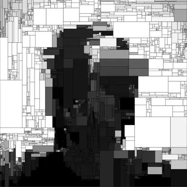

<section class="carousel-section">
    

        

            <input type="radio" name="slides" checked="checked" id="slide-1">
            <input type="radio" name="slides" id="slide-2">
            <input type="radio" name="slides" id="slide-3">
            <input type="radio" name="slides" id="slide-4">
            <input type="radio" name="slides" id="slide-5">
            <input type="radio" name="slides" id="slide-6">
            <ul class="carousel__slides">
                <li class="carousel__slide">
                    <figure>
                        

                            
                        

                        <figcaption>
                            Spearfishing with my childhood friend 
                            Coromandel, New Zealand
                        </figcaption>
                    </figure>
                </li>
                <li class="carousel__slide">
                    <figure>
                        

                            
                        

                        <figcaption>
                            On a morning long-run while I was still a student-athlete at UW
                            Teton County, Wyoming                            
                        </figcaption>
                    </figure>
                </li>
                <li class="carousel__slide">
                    <figure>
                        

                            
                        

                        <figcaption>
                            Dad and I giving some family friends a tour of the farm
                            Te Puke, New Zealand                            
                        </figcaption>
                    </figure>
                </li>
                <li class="carousel__slide">
                    <figure>
                        

                            
                        

                        <figcaption>
                            Running at the 2015, New Zealand National champs for 1500m 
                            Dunedin, New Zealand                             
                        </figcaption>
                    </figure>
                </li>
                <li class="carousel__slide">
                    <figure>
                        

                            
                        

                        <figcaption>
                            Out on a camping trip with my partner 
                            Vedauwoo, WY                             
                        </figcaption>
                    </figure>
                </li>
                <li class="carousel__slide">
                    <figure>
                        

                            
                        

                        <figcaption>
                            Hanging with the girls! 
                            Te Puke, New Zealand                            
                        </figcaption>
                    </figure>
                </li>
            </ul>    
            <ul class="carousel__thumbnails">
                <li>
                    <label for="slide-1"></label>
                </li>
                <li>
                    <label for="slide-2"></label>
                </li>
                <li>
                    <label for="slide-3"></label>
                </li>
                <li>
                    <label for="slide-4"></label>
                </li>
                <li>
                    <label for="slide-5"></label>
                </li>
                <li>
                    <label for="slide-6"></label>
                </li>
            </ul>
        

    

</section>

<iframe src="https://dhintz137.github.io/Completed_Works/" width="100%" height="600px" style="border: none; display: block;" onload="iframeLoaded()" allowfullscreen frameborder="25px"></iframe>

<figure>
  
  <figcaption>Cross-country skiing at Happy Jack, Laramie, Wyoming</figcaption>
</figure>

&nbsp;

<!DOCTYPE html>
<html>
<head>
    <title>Comparison Table</title>
    
</head>
<body>

<table border="1">
  <caption>Bayesian vs. Frequentist Statistics</caption>
  <colgroup>
    <col style="width: 20%;">
    <col style="width: 40%;">
    <col style="width: 40%;">
  </colgroup>
  <tr>
    <th></th>
    <th>Frequentist</th>
    <th>Bayesian</th>
  </tr>
  <tr>
    <td>Answer given</td>
    <td>Probability of the observed data given an underlying truth</td>
    <td>Probability of the truth given the observed data</td>
  </tr>
  <tr>
    <td>Population parameter</td>
    <td>Fixed, but unknown</td>
    <td>Prob. distribution of values</td>
  </tr>
  <tr>
    <td>Outcome measure</td>
    <td>Probability of extreme results, assuming null hypothesis (P value)</td>
    <td>Posterior probability of the hypothesis</td>
  </tr>
  <tr>
    <td>Weaknesses</td>
    <td>Logical inconsistency with clinical decision-making</td>
    <td>Subjectivity in priors' choice; complexity in PKPD modeling</td>
  </tr>
  <tr>
    <td>Strengths</td>
    <td>No need for priors; well-known methods</td>
    <td>Consistency with clinical decision-making</td>
  </tr>
  <tr>
    <td>PKPD application</td>
    <td>Good estimates with large data</td>
    <td>Adaptation of data to individuals</td>
  </tr>
</table>

</body>
</html>

**(Introna, Michele, et al, 2022)**[^2] 

&nbsp;

The data is on the percent body fat for 252 adult males, where the objective is to describe 13 simple body measurements in a multiple regression model; the data was collected from **Lohman, T, 1992**[^3] .

<!DOCTYPE html>
<html>
<body>
<head>

</head>
<body>
<table class = "ExtraPadRight">
<caption>Potential Predictors of Body Fat - Data from Lohman, T, 1992</caption>
<tbody>
  <tr>
    <td>1. Age (years)</td>
    <td>8. Thigh (cm)</td>
  </tr>
  <tr>
    <td>2. Weight (pounds)</td>
    <td>9. Knee (cm)</td>
  </tr>
  <tr>
    <td>3. Height (inches)</td>
    <td>10. Ankle (cm)</td>
  </tr>
  <tr>
    <td>4. Neck (cm)</td>
    <td>11. Extended biceps (cm)</td>
  </tr>
  <tr>
    <td>5. Chest (cm)</td>
    <td>12. Forearm (cm)</td>
  </tr>
  <tr>
    <td>6. Abdomen (cm)</td>
    <td>13. Wrist (cm)</td>
  </tr>
  <tr>
    <td>7. Hip (cm)</td>
    <td></td> 
  </tr>
</tbody>
</table>

</body>
</html>

  
Asparagus black-eyed bok bona brussels bunya cauliflower celtuce chestnut earthnut garbanzo gram green greens. Artichoke arugula avocado bamboo bell bitterleaf bok bunya carrot catsear cauliflower chard chestnut collard corn courgette dandelion dulse epazote esse fennel groundnut j. Asparagus aubergine azuki bamboo bean beetroot brussels cabbage celtuce cucumber dandelion dulse gram green groundnut. Asparagus aubergine avocado azuki bamboo beet beetroot bell carrot caulie celtuce chestnut chickpea coriander daikon dulse earthnut esse garlic green gumbo.

  
Aubergine bamboo bean beet beetroot bell bitterleaf black-eyed bona broccoli bunya burdock caulie chard chickpea choy coriander courgette daikon dandelion eggplant esse fava fennel gourd gram greens groundnut horseradish j. Asparagus aubergine azuki bean black-eyed bona cauliflower chestnut chickweed collard corn desert earthnut eggplant endive esse fava garbanzo gourd grape green groundnut j. Artichoke asparagus aubergine azuki black-eyed broccoli brussels cabbage carrot chestnut chickpea chicory.

  
Artichoke arugula asparagus aubergine bamboo bean beet bitterleaf black-eyed bok bologi bona brussels bush carrot caulie chestnut chickpea chickweed. Artichoke asparagus avocado bean beet bell bitterleaf bona bush carrot catsear caulie celtuce chestnut chickpea chickweed coriander corn earthnut esse garlic grape greens horseradish. Arugula avocado beetroot bitterleaf bok bona brussels burdock cabbage carrot catsear celtuce chestnut.

<h1>Look at this cute lil highlight</h1>

This is a sample paragraph. How cool is that? Very cool. Veeerrryyy cool.

Check out my highlighted text! It's like a marker!

And now we're back to normal text. With a few little surprises here and there.

Feel free to copy whatever you'd like here!

<!--FOOTNOTES-->
[^1]: [Givens and Hoeting, 2006](https://onlinelibrary.wiley.com/doi/book/10.1002/9781118555552)
[^2]: [Introna, Michele, et al, 2022](https://pubmed.ncbi.nlm.nih.gov/35147768/)
