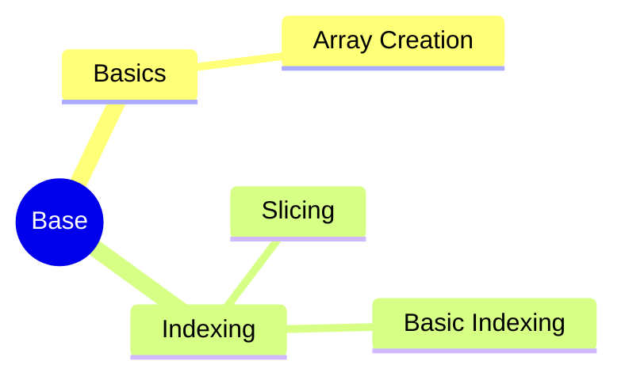

---
aliases:
  - 面向服务架构设计
  - SOA
  - service-oriented architecture
tags:
  - system
  - comput
draft: false
date:
---
<!-- # MindMap

*** -->

**[[面向服务的体系结构（SOA, service-oriented architecture）|SOA]] 是一种**粗粒度**、**松耦合**服务架构，服务之间通过**简单**、**精确定义接口**、进行通信，**不涉及底层编程接口和通信模型

### SOA 特性

- 针对某特定要求的输出，该服务就是运作一项商业逻辑
- 具有完备的特性（self-contained）
- 消费者并不需要了解此服务的运作过程
- 可能由底层其他服务组成
### SOA的原则

> [!warning] 在SOA中服务的设计原则中，粗粒度指的是服务数量不应该太大，依靠消息交互而不是远程过程调用(RPC)，通常消息量比较大，但是服务之间的交互频度较低

- 可重复使用、粒度、[模块性](https://zh.wikipedia.org/w/index.php?title=%E6%A8%A1%E7%B5%84%E6%80%A7&action=edit&redlink=1 "模块性（页面不存在）")、可组合型、对象化原件、构件化以及[具交互操作性](https://zh.wikipedia.org/w/index.php?title=%E5%85%B7%E4%BA%A4%E4%BA%92%E6%93%8D%E4%BD%9C%E6%80%A7&action=edit&redlink=1 "具交互操作性（页面不存在）")
- 符合开放标准（通用的或行业的）
- 服务的识别和分类，提供和发布，监控和跟踪。

### SOA 服务组成
SOA 的参考架构中包括业务逻辑服务（Business Logic Service）、控制服务（Control Service）、连接服务（Connectivity Service）、业务创新和优化服务（Business Innovation and Optimization Service）、开发服务（Development Service）、IT 服务管理（IT Service Management）

## 资源链接

[面向服务的体系结构 - 维基百科，自由的百科全书](https://zh.wikipedia.org/wiki/%E9%9D%A2%E5%90%91%E6%9C%8D%E5%8A%A1%E7%9A%84%E4%BD%93%E7%B3%BB%E7%BB%93%E6%9E%84)
