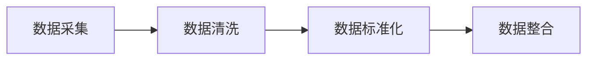
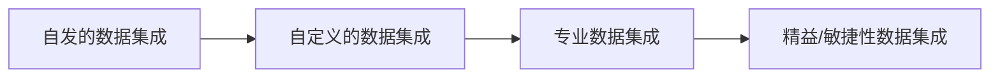

### 数据集成概述

> [!NOTE] 数据集成价值
> 对异构数据源数据进行大集中、大集成，消除企业信息**孤岛（数据离散化）**，实现数据集中共享，进而实现数据治理和数据应用的重要手段

#### 基本概念

> [[Data Integration Homepage|数据集成]]是指将异构数据源（不同数据库，系统或者是其他第三方数据源）的数据，通过某种方式整合到一起。从而为数据分析或者其他应用提供统一、准确的数据视图

[[DAMA|DAMA]]认为“数据集成旨在将数据整合为物理的或虚拟的一致格式”

#### 时延的基本概念

> 时延（Latency）是指从源生态生成数据到目标系统可用该数据的时间差。不同的数据处理方法会导致不同程度的数据延迟。延迟高 -> 批处理；延迟低 -> 事件驱动或者实时同步

- 批处理：定时调度，周期调度，针对数据量大的，要求非实时性的。如：“T+1” 今天处理昨天的数据
- 增量加载：数据增量捕获 [[CDC（Change Data Capture）]]
- 实时：来一条处理一条，时间极低
- 准实时：处理时间极短，毫秒级
- 流数据：手机短视频播放

#### 数据集成核心流程

#### 数据集成方式

> [!tip] 根据业务流程，数据环境，数据格式，确定数据需求，并考虑相关的安全性、合规性、可扩展性等因素再选择合适的集成方式

- [[ETL & ELT]]
- 实时数据集成
- 云数据集成
- 大数据集成

#### 数据集成的类型

- 下游集成
- 中游集成
- 上游集成

#### 应用场景

- 主数据应用
- 大数据迁移
- 数据入仓入湖
- 数据平台/数据工程

#### 数据集成技术

- 物理集成 & 虚拟集成
- [[ETL & ELT]]
- [[CDC（Change Data Capture）|CDC]]
- Push & Pull & Publish/Subscribe
- 批量 & 准时是 & 实时
- [[消息队列（MQ, Message Queue）]] & API

#### 数据集成产品及工具

##### Structure Data（Databases）

- [[Apache Sqoop]]
- [[DataX]]
- [[chunjun]]
- [[Apache DolphinScheduler]]
- [[Apache Inlong]]
##### Collection Logger 

- [[Apache Flume]]
- [[Apache Kafka]]

##### Web Spider

- Python 
- 数据埋点

#### 方案对比

| 方案    | Datax | Canal | Debezium | FlinkCDC | ChunJun | Sqoop |
| ----- | ----- | ----- | -------- | -------- | ------- | ----- |
| 采集机制  | 查询    | 日志    | 日志       |          |         | 查询    |
| 增量同步  | x     |       |          |          |         |       |
| 断点续传  | x     |       |          |          |         |       |
| 全量同步  | 1     |       |          |          |         |       |
| 全量+增量 |       |       |          |          |         |       |
| 生态    |       |       |          |          |         |       |

***
## DCMM 数据集成

#### 输出文件

***
## 数据集成开发

### 数据集成商业应用

### 企业数据集成能力发展的4个阶段

#### 商业模式

#### 商业案例
##### 全链路数据中台
- 离线数仓与数据同步
- 离线数据开发与调度
- 元数据、数据资产管理与治理

