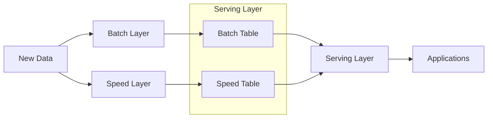

---
aliases:
  - Architecture
tags:
  - bigdata
  - architecture
date: 2024-03-29
draft:
---
### 数据架构的定义

#### DAMA观点

定义：识别企业的数据需求（无论数据结构如何），并设计和维护总监图已满足这些数据需求；使用总蓝图来指导数据集成、控制数据资产，并使数据资产与业务战略保持一致。

[[DAMA]] 的数据架构主要包括企业 **数据模型** 和 **数据流的设计**（也称数据价值链的设计）

#### DCMM 观点

[[DCMM]] 的数据架构包括

- 数据模型
- 数据架构
- 数据分布
- 数据集成与共享
- 元数据管理
- 数据标准
- 数据模型
- 数据生存周期
## 传统数据处理系统的问题

传统应用的数据系统架构设计时，应用直接访问数据库系统。当用户访问量增加时，数据库无法支撑日益增长的用户请求的负载，从而导致数据库服务器无法及时响应用户请求，出现超时的错误。关于这个问题的常用解决方法如下： 

- 增加异步处理队列，通过工作处理层批量处理异步处理队列中的数据修改请求
- 建立数据库水平分区，通常建立 Key 分区，以主键/唯一键 Hash 值作为 Key
- 建立数据库分片或重新分片，通常专门编写脚本来自动完成，且要进行充分测试
- 引入读写分离技术，主数据库处理写请求，通过复制机制分发至从数据库
- 引入分库分表技术，按照业务上下文边界拆分数据组织结构，拆分单数据库压力

### 大数据的特点 

大数据具有体量大、时效性强的特点，并非构造单调，而是类型多样；处理大数据时，传统数据处理系统因数据过载，来源复杂，类型多样等诸多原因性能低下，需要采用以新式计算架构和智能算法为代表的新技术；大数据的应用重在发掘数据间的相关性，而非传统逻辑上的因果关系；因此，大数据的目的和价值就在于发现新的知识，洞悉并进行科学决策。现代大数据处理技术，主要分为以下几种： 

- 基于分布式文件系统 [[Apache Hadoop|Hadoop]] 
- 使用 Map/Reduce 或 [[Apache Spark|Spark]] 数据处理技术
- 使用 [[Apache Kafka|Kafka]] 数据传输消息队列及  二进制格式

### 数据架构的核心内容及其演变

## 典型的大数据架构 

### Lambda Architecture

> Lambda架构（Lambda Architecture） 是由Twitter工程师南森•马茨 （Nathan Marz）提出的大数据处理架构

Lambda 总共由三层系统组成：批处理层（Batch Layer）， 速度处理层（Speed Layer），以及用于响应查询的 服务层（Serving Layer），是一种用于同时处理离线和实时数据的、可容错的、可扩展的分布式系统，如下图所示

- 批处理层：该层核心功能是存储主数据集，主数据集数据具有原始、不可变、真实的特征。批处理层周期性地将增量数据转储至主数据集，并在主数据集上执行批处理，生成批视图。架构实现方面可以使用 [[HDFS]] 或 [[Apache HBase|Hbase]] 存储主数据集，再利用 [[Apache Spark|Spark]] 或 [[MapReduce]] 执行周期批处理，之后使用 MapReduce 创建批视图

- 加速层：该层的核心功能是处理增量实时数据，生成实时视图，快速执行即席查询。架构实现方面可以使用 [[HDFS]] 或 [[Apache HBase|Hbase]] 存储实时数据，利用 [[Apache Spark|Spark]] 或 [[Storm]] 实现实时数据处理和实时视图。

- 服务层：该层的核心功能是响应用户请求，合并批视图和实时视图中的结果数据集得到最终数据集。具体来说就是接收用户请求，通过索引加速访问批视图，直接访问实时视图，然后合并两个视图的结果数据集生成最终数据集，响应用户请求。架构实现方面可以使用 HBase Cassandra 作为服务层，通过 Hive 创建可查询的视图
#### Lambda 架构优缺点 

- Lambda 架构的优点：对硬件故障和人为失误有很好的容错性，查询灵活度高，弹性伸缩，易于扩展
- Lambda 架构的缺点：编码量大，持续处理成本高，重新部署和迁移成本高。 与 Lambda 架构相似的模式有事件溯源模式、命令查询职责分离模式
### Lambda 在Twitter

> [!info] 
> 与 Lambda 架构相似的模式有事件溯源模式、命令查询职责分离模式
![[Lambda Twitter.png]]

### Kappa Architecture

> [!summary] 
>  Kappa 架构本质上是通过改进 Lambda 架构中的加速层(删除了 Batch Layer 的架构,将数据通道以消息队列进行替代)，使它既能够进行实时数据处理，同时也有能力在业务逻辑更新的情况下重新处理以前处理过的历史数据

![[Kappa Architecture.png]]
### Lambda 架构和 Kappa 架构特性对比 

| 对比内容       | Lambda 架构                                    | Kappa 架构                                  |
|------------|----------------------------------------------|-------------------------------------------|
| 复杂度与开发维护成本 | 维护两套系统（引擎），复杂度高，成本高,周期性批处理计算，持续实时计算          | 维护一套系统（引擎），复杂度低，成本低                       |
| 计算开销       | 计算开销大                                        | 必要时进行全量计算                                 |
| 实时性        | 满足实时性                                        | 计算开销相对较小                                  |
| 历史数据处理能力   | 批式全量处理，吞吐量大 历史数据处理能力强 批视图与实时视图存在冲突可能 | 满足实时性 流式全量处理，吞吐量相对较低 历史数据处理能力相对较弱 |
| 业务需求与技术要求  | 依赖 Hadoop、 Spark、Storm 技术                    | 依赖 Flink 计算引擎，偏流式计算                       |
| 复杂度        | 实时处理和离线处理结果可能不一致                             | 频繁修改算法模型参数                                |
| 开发维护成本     | 成本预算充足                                       | 成本预算有限                                    |
| 历史数据处理能力   | 频繁使用海量历史数据                                   | 仅使用小规模数据集                                 |

### 数据架构的实施指南

### 现代数据架构

### 数据架构的评估

***
## Reference

- [深入理解大数据架构之——Lambda架构 - Heriam - 博客园](https://www.cnblogs.com/cciejh/p/lambda-architecture.html)
- [Lambda架构：一个用于亿级实时数据分析的架构-duidaima 堆代码](https://www.duidaima.com/Group/Topic/ArchitecturedDesign/14319)