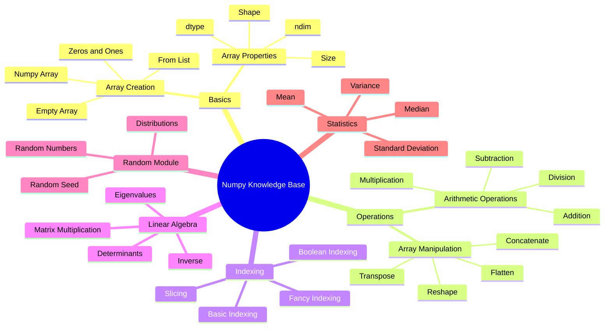

## 概述

### NumPy 定义

> [NumPy](https://numpy.org/doc/stable/user/whatisnumpy.html) is the fundamental package for scientific computing in Python. It is a Python library that provides a multidimensional array object, various derived objects (such as masked arrays and matrices), and an assortment of routines for fast operations on arrays, including mathematical, logical, shape manipulation, sorting, selecting, I/O, discrete Fourier transforms, basic linear algebra, basic statistical operations, random simulation and much more.

NumPy 是 Python 中科学计算的基础包。它是一个 Python 库，提供多维数组对象、各种派生对象（例如掩码数组和矩阵）以及用于对数组进行快速操作的各种例程，包括数学、逻辑、形状操作、排序、选择、I/O 、离散傅里叶变换、基本线性代数、基本统计运算、随机模拟等等。


NumPy 包的核心是 [ndarray](https://numpy.org/doc/stable/reference/generated/numpy.ndarray.html#numpy.ndarray) 对象。这封装了同质数据类型的_n_维数组，许多操作在编译代码中执行以提高性能。


## 开发文档


```python
import numpy as np
```

Demo Code :

```python
import numpy as np
a = np.arange(15).reshape(3, 5)
a
a.shape
a.ndim
a.dtype.name
a.itemsize
a.size
type(a)
b = np.array([6, 7, 8])
b
type(b)
```


## 参考资源


- [What is NumPy? — NumPy v2.1 Manual](https://numpy.org/doc/stable/user/whatisnumpy.html)
- [NumPy - Installing NumPy](https://numpy.org/install/)
- 