---
aliases:
  - spider
tags:
  - Python
date: 
draft: true
---
### 爬虫的基本流程

用户获取网络数据的方式：

方式1：浏览器提交请求--->下载网页代码--->解析成页面

方式2：模拟浏览器发送请求(获取网页代码)->提取有用的数据->存放于数据库或文件中爬虫要做的就是方式2；

```mermaid
graph LR
    A[发送请求] --> B[获取相应内容]
    B --> C[解析内容]
    C --> D[保存数据]
```

1、发起请求

使用http库向目标站点发起请求，即发送一个Request

Request包含：请求头、请求体等 

Request模块缺陷：不能执行JS 和CSS 代码

2、获取响应内容

如果服务器能正常响应，则会得到一个Response

Response包含：html，json，图片，视频等

3、解析内容

解析html数据：正则表达式（RE模块），第三方解析库如Beautifulsoup，pyquery等

解析json数据：json模块

解析二进制数据:以wb的方式写入文件

4、保存数据

数据库（MySQL，Mongdb、Redis）

### pyspider

[Introduction - pyspider](http://docs.pyspider.org/en/latest/)

### Scrapy

Scrapy是一个基于Twisted的开源的Python爬虫框架，在工业中应用非常广泛。

相关内容可以参考[基于Scrapy网络爬虫的搭建](http://www.lining0806.com/%E5%9F%BA%E4%BA%8Escrapy%E7%BD%91%E7%BB%9C%E7%88%AC%E8%99%AB%E7%9A%84%E6%90%AD%E5%BB%BA/)，同时给出这篇文章介绍的[微信搜索](http://weixin.sogou.com/weixin)爬取的项目代码，给大家作为学习参考。

参考项目：[使用Scrapy或Requests递归抓取微信搜索结果](https://github.com/lining0806/PythonSpiderNotes/blob/master/WechatSearchProjects)

### 开发案例

***
## Reference

- [绿色先锋](https://www.greenxf.com/)
- 

#### Open Source Projects

- [GitHub - NaiboWang/EasySpider: A visual no-code/code-free web crawler/spider易采集：一个可视化浏览器自动化测试/数据采集/爬虫软件，可以无代码图形化的设计和执行爬虫任务。别名：ServiceWrapper面向Web应用的智能化服务封装系统。](https://github.com/NaiboWang/EasySpider)
- [GitHub - gocolly/colly: Elegant Scraper and Crawler Framework for Golang](https://github.com/gocolly/colly)
- [GitHub - facert/awesome-spider: 爬虫集合](https://github.com/facert/awesome-spider)
- [GitHub - ssssssss-team/spider-flow: 新一代爬虫平台，以图形化方式定义爬虫流程，不写代码即可完成爬虫。](https://github.com/ssssssss-team/spider-flow)
- [GitHub - dataabc/weiboSpider: 新浪微博爬虫，用python爬取新浪微博数据](https://github.com/dataabc/weiboSpider)
- [GitHub - kangvcar/InfoSpider: INFO-SPIDER 是一个集众多数据源于一身的爬虫工具箱🧰，旨在安全快捷的帮助用户拿回自己的数据，工具代码开源，流程透明。支持数据源包括GitHub、QQ邮箱、网易邮箱、阿里邮箱、新浪邮箱、Hotmail邮箱、Outlook邮箱、京东、淘宝、支付宝、中国移动、中国联通、中国电信、知乎、哔哩哔哩、网易云音乐、QQ好友、QQ群、生成朋友圈相册、浏览器浏览历史、12306、博客园、CSDN博客、开源中国博客、简书。](https://github.com/kangvcar/InfoSpider)
- [GitHub - guyueyingmu/avbook: AV 电影管理系统， avmoo , javbus , javlibrary 爬虫，线上 AV 影片图书馆，AV 磁力链接数据库，Japanese Adult Video Library,Adult Video Magnet Links - Japanese Adult Video Database](https://github.com/guyueyingmu/avbook)
- [GitHub - xiangyuecn/AreaCity-JsSpider-StatsGov: 省市区县乡镇三级或四级城市数据，带拼音标注、坐标、行政区域边界范围；2024年06月16日最新采集，提供csv格式文件，支持在线转成多级联动js代码、通用json格式，提供软件转成shp、geojson、sql、导入数据库；带浏览器里面运行的js采集源码，综合了中华人民共和国民政部、国家统计局、高德地图、腾讯地图行政区划数据](https://github.com/xiangyuecn/AreaCity-JsSpider-StatsGov)
	- [最新2024年省市区县乡镇街道行政区划数据可导入mysql sql server数据库可三级四级多级联动，坐标边界范围矢量数据支持shp geojson arcgis arcmap qgis mapinfo gis地理围栏 - AreaCity-JsSpider-StatsGov](https://xiangyuecn.github.io/AreaCity-JsSpider-StatsGov/)
- [GitHub - baabaaox/ScrapyDouban: 豆瓣电影/豆瓣读书 Scarpy 爬虫](https://github.com/baabaaox/ScrapyDouban)

### Documents

- [Introduction - pyspider](http://docs.pyspider.org/en/latest/)
- [GitHub - lining0806/PythonSpiderNotes: Python入门网络爬虫之精华版](https://github.com/lining0806/PythonSpiderNotes)
