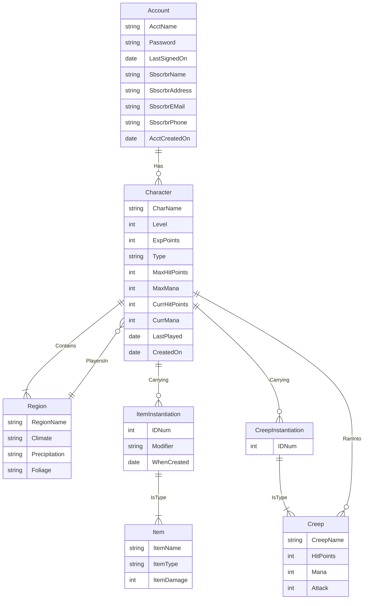

## 概述

**R模型**，全称为**实体联系模型**、**实体关系模型**或**实体联系模式图（ERM）**（英语：Entity-relationship model）由美籍台湾人计算机科学家[陈品山](https://zh.wikipedia.org/wiki/%E9%99%88%E5%93%81%E5%B1%B1 "陈品山")发明，是[概念数据模型](https://zh.wikipedia.org/wiki/%E6%A6%82%E5%BF%B5%E6%A8%A1%E5%9E%8B "概念模型")的高层描述所使用的[数据模型](https://zh.wikipedia.org/wiki/%E6%95%B0%E6%8D%AE%E6%A8%A1%E5%9E%8B "数据模型")或[模式图](https://zh.wikipedia.org/w/index.php?title=%E6%A8%A1%E5%BC%8F%E5%9B%BE&action=edit&redlink=1 "模式图（页面不存在）")。

### 案例

图例解释：

- **USER** 表表示用户，具有 user_id、username、email 和 password 字段。用户可以下订单
- **ORDER** 表表示订单，具有 order_id、order_date 和 total_amount 字段。每个订单由一个用户发起，user_id 是外键
- **PRODUCT** 表表示产品，具有 product_id、name 和 price 字段。
- **ORDER_ITEM** 表表示订单项，记录每个订单中的具体产品和数量。它通过 order_id 和 product_id 两个外键连接到 ORDER 和 PRODUCT 表。

这样，一个用户可以有多个订单，一个订单可以包含多个产品，而每个产品也可以出现在多个订单中。

### 定义

### 原理 & 功能

## 资源链接

[ER模型 - 维基百科，自由的百科全书](https://zh.wikipedia.org/wiki/ER%E6%A8%A1%E5%9E%8B)

## 参考文献 

