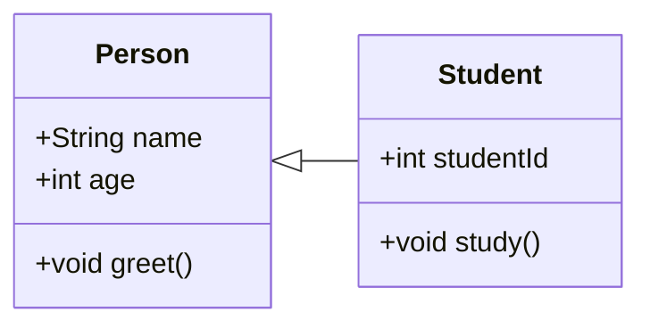
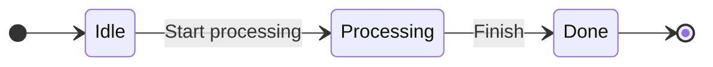
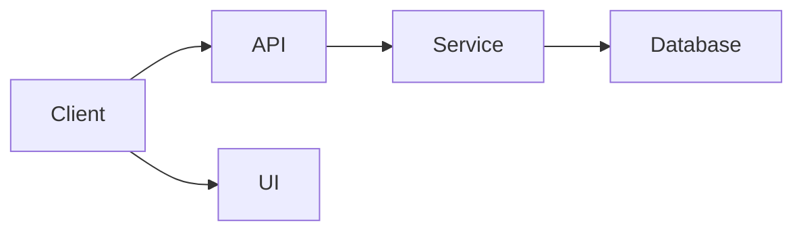

## 概述
### 定义

UML即Unified Model Language，是一种建模语言，也是标准建模语言。在软件开发中，当系统规模比较复杂时，需要用图形抽象地来表达复杂的概念，让整个软件设计更具有可读性，可理解性，以便尽早发现软件设计时存在的潜在问题，从而降低开发风险。同时，也极大地方便了业务人员与开发人员之间的交流。

### 分类

##### **在面向对象系统分析与设计中**

- 行为图：用来描述事物之间的关系
	- 包括类图、对象图、组件图和部署图

- **行为图**：用来描述参与者和用例之间的交互，或者描述参与者如何使用系统
	- 包括用例图、顺序图、活动图、状态图和通信图

##### **在系统开发中**

- **功能模型**：从用户的角度展示系统的功能，包括用例图。
- **对象模型**：采用对象，属性，操作，关联等概念展示系统的结构和基础，包括类别图、对象图。
- **动态模型**：展现系统的内部行为。包括序列图，活动图，状态图。

**用例图（Use Case Diagram）**

**组件图（Component Diagram）**

#### UML中事物的分类

- 结构事物：是UML模型中的名词。它们通常是模型的静态部分,描述概念或物理元素
- 行为事物：是UML模型的动态部分。它们是模型中的动词,描述了跨越时间和空间的行为
- 分组事物：是UML模型的组仅部分。它们是—些由模型分解成的盒子
- 注释事物：是UML模型的解释部分。这些注释事物用来描述、说明和标注模型的任何元素
## UML相关产品或者工具

- [Visual Paradigm - UML, Agile, PMBOK, TOGAF, BPMN and More!](https://www.visual-paradigm.com/features/)
- [亿图图视软件 【Windows】](https://cc-download.edrawsoft.cn/edraw-max_cn_full8635.exe?_gl=1*knowmn*_gcl_au*MTUxMTMyNDQ1Mi4xNzI4ODg0OTE1*_ga*NTI5ODg3NjI1LjE3Mjg4ODQ5MTU.*_ga_24WTSJBD5B*MTcyODg4NDkxNC4xLjEuMTcyODg4NTQ5MC42MC4wLjE1MTUyNTE3OTA.)

***
## Reference

- [统一建模语言 - 维基百科，自由的百科全书](https://zh.wikipedia.org/zh-cn/%E7%BB%9F%E4%B8%80%E5%BB%BA%E6%A8%A1%E8%AF%AD%E8%A8%80)
- [什么是统一建模语言（UML）？](https://www.visual-paradigm.com/cn/guide/uml-unified-modeling-language/what-is-uml/)
- [什么是UML图?常见的UML图有哪些？](https://www.edrawsoft.cn/uml-diagram-introduction/)

