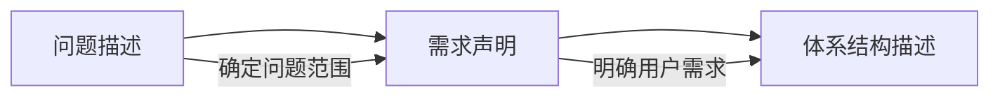

---
aliases:
  - SAAM
  - Software Architecture Analysis Method
tags:
  - concepts
  - system
  - theory
  - architecture
date: 2023-12-16
publish: false
---

## 概述

### 定义

**SAAM (Software Architecture Analysis Method)** 是一种用于分析和评估软件体系结构的方法，旨在通过一组标准化的流程，评估体系结构是否满足其功能性和非功能性需求，特别是软件的

### 组成

SAAM分析评估体系结构的过程包括五个步骤

- 场景开发
- 体系结构描述
- 单个场景评估
- 场景交互
- 总体评估

**SAAM的主要输入问题**

### 应用场景

SAAM 经常用于早期架构设计阶段，通过评估架构在应对未来需求变化时的灵活性和适应性，来帮助设计更加健壮、灵活的软件架构。它适用于需要高稳定性、易扩展性和易维护性的大型企业应用、分布式系统等场景。

***
## Reference

