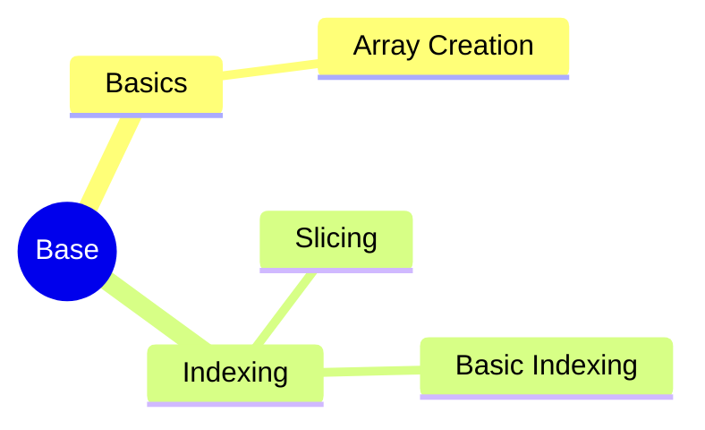

---
aliases:
  - Factory Method
  - FM
  - 工厂模式
  - 虚拟构造函数
  - Virtual Constructor
tags:
  - system
  - comput
draft: true
date:
---
# MindMap




***
## Referecne

```mermaid
graph LR
    A[] --> B[]
    B --> C[]
    C --> D[]
    D --> E[]
    E --> F[]
    F --> G[]

	B -.-> |O:N| D
```
