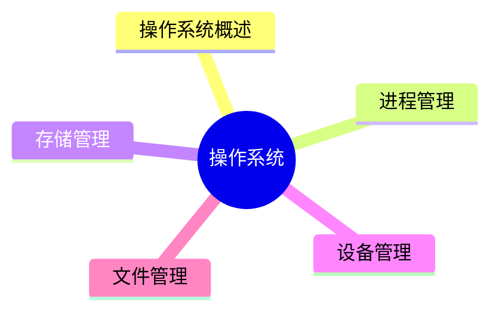
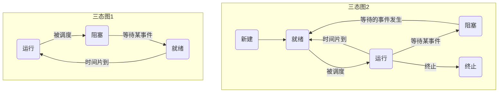

# MindMap


***

## 操作系统概述

> **操作系统定义：** 能有效地组织和管理系统中的各种软/硬件资源，合理地组织计算机系统工作流程，控制程序的执行，并且向用户提供一个良好的工作环境和友好的接口

#### 特征

- 并发性
- 共享性
- 虚拟性
- 不确定性

#### 操作系统的功能

- 进程管理
- 文件管理
- 存储管理
- 作业管理

#### 操作系统的分类

- 分时操作系统
- 实时操作系统
- 分布式操作系统
- 批处理操作系统
- 网络操作系统
- 微型计算机操作系统
- 嵌入式操作系统

#### 嵌入式操作系统主要特点

- 微型化
- 可定制
- 实时性
- 可靠性
- 易移植性

#### 嵌入式系统初始化过程

按照自底向上、从硬件到软件的次序依次为：


- 芯片级是微处理器的初始化
- 板卡级是其他硬件设备初始化
- 系统级初始化就是软件及操作系统初始化

***
## 进程管理 

#### 进程的组成和状态

**进程的组成：** 进程控制块PCB(唯一标志)、程序(描述进程要做什么)、数据(存放进程执行时所需数据)

进程三态之间的转换如下图所示：


- **前趋图：** 用来表示哪些任务可以并行执行，哪些任务之间有顺序关系
- **进程资源图：** 用来表示进程和资源之间的分配和请求关系
- 死锁状态：当一个进程资源图中所有进程都是阻塞节点时，即陷入死锁状态

互斥和同步并非反义词，互斥表示一个资源在同一时间内只能由一个任务单独使用，需要加锁，使用完后解锁才能被其他任务使用

同步表示两个任务可以同时执行，只不过有速度上的差异，需要速度上匹配，不存在资源是否单独或共享的问题

#### 信号量

**信号量操作的基本概念：**

- 临界资源：各个进程间需要互斥方式对其进行共享的资源，即在某一时刻只能被一个进程使用，该进程释放后又可以被其他进程使用
- 临界区：每个进程中访问临界资源的那段代码
- 信号量：是一种特殊的变量

**信号量操作的两类信号量：**

- 互斥信号量：对临界资源采用互斥访问，使用互斥信号量后其他进程无法访问，初值为1
- 同步信号量：对共享资源的访问控制，初值是共享资料的个数

**信号量操作的P操作和V操作：**

> 都是原子操作，用来解释进程间的同步和互斥原理

#### 进程调度

**进程调度方式：** 是指当`有更高优先级的进程`到来时如何分配CPU。分为`可剥夺`和`不可剥夺`两种

- 可剥夺：指当有更高优先级进程到来时，强行将正在运行进程的CPU分配给高优先级进程
- 不可剥夺：是指高优先级进程必须等待当前进程自动释放CPU

**调度算法分类：**

- **先来先服务FCFS：** 先到达的进程优先分配CPU。用于宏观调度
- **时间片轮转：** 分配给每个进程CPU时间片，轮流使用CPU，每个进程时间片大小相同，很公平，用于微观调度
- **优先级调度：** 每个进程都拥有一个优先级，优先级大的先分配CPU
- **多级反馈调度：** `时间片轮转`和`优先级调度`结合而成

#### 死锁问题

**死锁问题：** 当一个进程在等待永远不可能发生的事件时，就会产生死锁，若系统中有多个进程处于死锁状态，就会造成系统死锁

**死锁产生的四个必要条件：** 资源互斥、每个进程占有资源并等待其他资源、系统不能剥夺进程资源、进程资源图是一个环路

**死锁产生后，解决措施是打破四大条件：** 死锁预防、死锁避免、死锁检测、死锁解除

**死锁预防：** 采用某种策略限制并发进程对于资源的请求，破坏死锁产生的四个条件之一，使系统任何时刻都不满足死锁的条件

**死锁避免：** 一般采用银行家算法来避免，银行家算法，就是提前计算出一条不会死锁的资源分配方法，才分配资源，否则不分配资源，相当于借贷，考虑对方还得起才借钱，提前考虑好以后，就可以避免死锁

**死锁检测：** 允许死锁产生，但系统定时运行一个检测死锁的程序，若检测到系统中发生死锁，则  
设法加以解除

**死锁解除：** 即死锁发生后的解除方法，如强制剥夺资源，撤销进程等

#### 线程

**传统的进程有两个属性：** 可拥有资源的独立单位、可独立调度和分配的基本单位

**线程是进程中的一个实体，是被系统独立**分配**和**调度**的基本单位。**

线程基本上不拥有资源，只拥有一点运行中必不可少的资源(如程序计数器、一组寄存器和栈)，它可与同属一个进程的其他线程共享进程所拥有的全部资源，例如进程的公共数据、全局变量、代码、文件等资源，但不能共享线程独有的资源，如线程的栈指针等标识数据

***
## 存储管理 

#### 存储管理

#### 分区存储管理

**存储器的结构：** 寄存器、高速缓存Cache、主存、外存

**分区存储管理：** 就是整存，将某进程运行所需的内存整体一起分配给它，然后再执行

**分区存储管理三种分区方式：** 固定分区、**可变分区**、**可重定位分区**

- **固定分区：** 静态分区方法，将主存分为若干个固定的分区，将要运行的作业装配进去，由于分区固定，大小和作业需要的大小不同，会产生内部碎片
- **可变分区：** 动态分区方法，主存空间的分区是在作业转入时划分，正好划分为作业需要的大小，这样就不存在内部碎片，但容易将整片主存空间切割成许多块，会产生外部碎片
- **可重定位分区：** 可以解决碎片问题，移动所有已经分配好的区域，使其成为一个连续的区域，这样其他外部细小的分区碎片可以合并为大的分区，满足作业要求。只在外部作业请求空间得不到满足时进行

#### 分页存储管理

**分页存储管理：** 如果采用分区存储，都是整存，会出现一个问题，即`当进程运行所需的内存大于系统内存时`，就无法将整个进程一起调入内存，因此无法运行，若要解决此问题，就要采用段页式存储组织，页式存储是基于`可变分区而`提出的

逻辑页分为页号和页内地址，页内地址就是物理偏移地址，而页号与物理块号并非按序对应的，需要查询页表，才能得知页号对应的物理块号，再用物理块号加上偏移地址才得出了真正运行时的物理地址

**分页存储管理优点：** 利用率高，碎片小，分配及管理简单
#### 页面置换算法

- **页面置换算法最优算法：** OPT，理论上的算法，无法实现，是在进程执行完后进行的最佳效率计算，用来让其他算法比较差距。原理是选择未来最长时间内不被访问的页面置换，这样可以保证未来执行的都是马上要访问的

- **页面置换算法先进先出算法：** FIFO，先调入内存的页先被置换淘汰，会产生抖动现象，即分配的页数越多，缺页率可能越多(即效率越低)

- **页面置换算法最近最少使用：** LRU，在最近的过去，进程执行过程中，过去最少使用的页面被置换淘汰，根据局部性原理，这种方式效率高，且不会产生抖动现象，使用大量计数器，但是没有LFU多

- **页面置换算法淘汰原则：** 优先淘汰最近未访问的，而后淘汰最近未被修改的页面

#### 快表

**快表：** 是一块小容量的相联存储器，由快速存储器组成，按内容访问，速度快，并且可以从硬件上保证按内容并行查找，一般用来存放当前访问最频繁的少数活动页面的页号

快表是将页表存于Cache中，慢表是将页表存于内存上。慢表需要访问两次内存才能取出页，而快表是访问一次Cache和一次内存，因此更快
#### 断式存储管理

**段式存储管理：** 将进程空间分为一个个段，每段也有段号和段内地址，与页式存储不同的是，每段物理大小不同，分段是根据逻辑整体分段的，因此，段表也与页表的内容不同，页表中直接是逻辑页号对应物理块号，而下图所示，段表有段长和基址两个属性，才能确定一个逻辑段在物理段中的位置

- **段式存储管理优点：** 多道程序共享内存，各段程序修改互不影响

- **段式存储管理缺点：** 内存利用率低，内存碎片浪费大

**分页和分段存储管理的区别：** 分页是根据物理空间划分，每页大小相同；分段是根据逻辑空间划分，每段是一个完整的功能，便于共享，但是大小不同

**地址表示(段号，段内偏移)：** 其中段内偏移不能超过该段号对应的段长，否则越界错误，而此地址对应的真正内存地址应该是：段号对应的`基地址 + 段内偏移`
#### 段页式存储管理

**段页式存储管理对进程空间先分段，后分页，具体原理图和优缺点如下：**

- 优点：空间浪费小、存储共享容易、存储保护容易、能动态链接

- 缺点：由于管理软件的增加，复杂性和开销也随之增加，需要的硬件以及占用的内容也有所增加，使得执行速度大大下降

***
## 设备管理 

**设备：** 是计算机系统与外界交互的工具，具体负责计算机与外部的输入/输出工作，所以常称为外部设备(简称外设)。在计算机系统中，将负责管理设备和输入/输出的机构称为I/O系统。因此，I/O系统由设备、控制器、通道(具有通道的计算机系统)、总线和I/O软件组成

***
## 文件管理 

**文件(File)：** 是具有符号名的、在逻辑上具有完整意义的一组相关信息项的集合

**文件的物理结构是指文件的内部组织形式，即文件在物理存储设备上的存放方法，包括**

- 连续结构
- 链接结构
- 索引结构
- 多个物理块的索引表

***
## Reference

```mermaid
graph LR
    A[] --> B[]
    B --> C[]
    C --> D[]
    D --> E[]
    E --> F[]
    F --> G[]

	B -.-> |O:N| D
```
