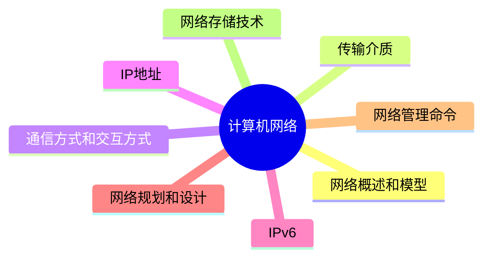

# MindMap


***
## 网络概述和模型

#### 基本概念

- **计算机网络的功能：** 数据通信、资源共享、管理集中化、实现分布式处理、负载均衡

**网络指标**

- **网络性能指标：** 速率、带宽(频带宽度或传送线路速率)、吞吐量、时延、往返时间、利用率
- **网络非性能指标：** 费用、质量、标准化、可靠性、可扩展性、可升级性、易管理性和可维护性

**信道：** 分为物理信道和逻辑信道

- 物理信道：由传输介质和设备组成，根据传输介质的不同，分为无线信道和有线信道
- 逻辑信道：是指在数据发送端和接收端之间存在的一条虚拟线路，可以是有连接的或无连接的。逻辑信道以物理信道为载体

- **发信机进行的信号处理：** 包括信源编码、信道编码、交织、脉冲成形和调制
- **收信机进行的信号处理**：包括解调、采样判决、去交织、信道译码和信源译码

#### 网络结构

- 总线型(利用率低、干扰大、价格低)
- 星型(交换机形成的局域网、中央单元负荷大)，eg：办公室局域网是星型拓扑结构，中间节点就是交换机，一旦交换机损坏，整个网络都瘫痪了
- 环型(流动方向固定、效率低扩充难)
- 树型(总线型的扩充、分级结构)
- 分布式(任意节点连接、管理难成本高)

#### 网络协议

**以太网规范IEEE802.3是重要的局域网协议**

> [!info] **无线局域网WLAN技术标准：**IEEE802.11

| 规范名称         | 描述    | 速度       | 传输介质       |
| ------------ | ----- | -------- | ---------- |
| IEEE 802.3   | 标准以太网 | 10Mb/s   | 传输介质为细同轴电缆 |
| IEEE 802.3u  | 快速以太网 | 100Mb/s  | 双绞线        |
| IEEE 802.3z  | 干兆以太网 | 1000Mb/s | 光纤或双绞线<br> |
| IEEE 802.3ae | 万兆以太网 | 10Gb/s   | 光纤         |

**参见的网络协议**

> [!tip] TCP/IP协议网络协议三要素： 语法、语义、时序

**网络协议对应端口**

| 名称     | 协议全称                                | 描述                                             | 端口             | 位于网络分层的那层 |
| ------ | ----------------------------------- | ---------------------------------------------- | -------------- | --------- |
| IP     | Internet Protocol                   | 网络层最重要的核心协议，在源地址和目的地址之间传送数据报，无连接、不可靠           | ❌              | 网络层协议     |
| ICMP   | Internet Control Message Protocol   | 用于在IP主机、路由器之间传递控制消息。控制消息包括网络通不通、主机是否可达、路由是否可用等 | ❌              | 网络层协议     |
| ARP    | Address Resolution Protocol         | 地址解析协议，将IP地址转换为物理地址                            | ❌              | 网络层协议     |
| RARP   | Reverse Address Resolution Protocol | 地址反解析协议，将物理地址转换为IP地址                           | ❌              | 网络层协议     |
| IGMP   | Internet Group Management Protocol  | 允许因特网中的计算机参加多播，向相邻多播路由器报告多播组成员的协议，支持组播         | ❌              | 网络层协议     |
| TCP    | Transmission Control Protocol       | 传输层协议，提供可靠的、面向连接的、全双工的数据传输服务，常用于数据量小但可靠性要求高的场合 | 80, 443        | 传输层协议     |
| UDP    | User Datagram Protocol              | 无连接、不可靠的传输协议，速度快，常用于数据量大但对可靠性要求不高的场合           | 53, 67-68      | 传输层协议     |
| FTP    | File Transfer Protocol              | 文件传输协议，提供可靠的双向文件传输服务                           | 20(数据), 21（控制） | 应用层协议     |
| HTTP   | Hypertext Transfer Protocol         | 超文本传输协议，用于从WWW服务器传输超文本到本地浏览器                   | 80             | 应用层协议     |
| HTTPS  | Hypertext Transfer Protocol Secure  | 基于SSL加密的超文本传输协议，确保网页传输的安全性                     | 443            | 应用层协议     |
| SMTP   | Simple Mail Transfer Protocol       | 简单邮件传输协议，用于源地址到目的地址的邮件传输                       | 25             | 应用层协议     |
| POP3   | Post Office Protocol version 3      | 邮局协议第三版，用于邮件接收                                 | 110            | 应用层协议     |
| Telnet | Telnet                              | 远程登录协议，是因特网远程连接服务的标准协议和主要方式                    | 23             | 应用层协议     |
| TFTP   | Trivial File Transfer Protocol      | 小文件传输协议，不可靠但开销较小                               | 69             | 应用层协议     |
| SNMP   | Simple Network Management Protocol  | 简单网络管理协议，用于网络管理系统监测连接到网络的设备                    | 161            | 应用层协议     |
| DHCP   | Dynamic Host Configuration Protocol | 动态主机配置协议，基于C/S模型，为主机动态分配IP地址                   | 67-68          | 应用层协议     |
| DNS    | Domain Name System                  | 域名解析协议，将域名解析为IP地址                              | 53             | 应用层协议     |

#### 交换机

**交换机功能：**

- 集线功能：提供大量可供线缆连接的端口达到部署星状拓扑网络的目的
- 中继功能：在转发帧时重新产生不失真的电信号
- 桥接功能：在内置的端口上使用相同的转发和过滤逻辑
- 隔离冲突域功能：将部署好的局域网分为多个冲突域，而每个冲突域都有自己独立的带宽，以提高交换机整体宽带利用效率

#### 路由器

> [!note] 路由器工作在OSI七层协议中的第3层，即网络层

**路由器功能：**

- 异种网络互连：比如具有异种子网协议的网络互连
- 子网协议转换：不同子网间包括局域网和广域网之间的协议转换
- 数据路由：即将数据从一个网络依据路由规则转发到另一个网络
- 速率适配：利用缓存和流控协议进行适配 
- 隔离网络：防止广播风暴，实现防火墙 
- 报文分片和重组：超过接口的MTU报文被分片，到达目的地之后的报文被重组
- 备份、流量控制：如主备线路的切换和复杂流量控制等

	**路由协议：** 路由协议可分`内部网关协议(IGP)`和`外部网关协议(EGP)`两类

***
## 传输介质

**双绞线：** 将多根铜线按规则缠绕在一起，能够减少干扰；分为无屏蔽双绞线UTP和屏蔽双绞线STP，都是由一对铜线簇组成。也即我们常说的网线，双绞线的传输距离在100m以内

- **无屏蔽双绞线UTP：** 价格低，安装简单，可靠性相对较低，分为CAT3(3类UTP，速率为10Mbps)、CAT4(4类UTP，与3类差不多，无应用)、CAT5(5类UTP，速率为100Mbps，用于快速以太网)、CAT5E(超5类UTP，速率为1000Mbps)、CAT6(6类UTP，用来替代CAT5E，速率也是1000Mbps)
- **屏蔽双绞线STP：** 比之UTP增加了一层屏蔽层，可以有效的提高可靠性，但对应的价格高，安装麻烦，一般用于对传输可靠性要求很高的场合

**光纤：** 由纤芯和包层组成，传输的光信号在纤芯中传输，然而从PC端出来的信号都是电信号，要经过光纤传输的话，就必须将电信号转换为光信号

- **多模光纤MMF**：纤芯半径较大，因此可以同时传输多种不同的信号，光信号在光纤中以全反射的形式传输，采用发光二极管LED为光源，成本低，但是传输的效率和可靠性都较低，适合于短距离传输，其传输距离与传输速率相关，速率为100Mbps时为2KM，速率为1000Mbps时为550m
- **单模光纤SMF：** 纤芯半径很小，一般只能传输一种信号，采用激光二极管LD作为光源，并且只支持激光信号的传播，同样是以全反射形式传播，只不过反射角很大，看起来像一条直线，成本高，但是传输距离远，可靠性高。传输距离可达5KM

**无线信道：** 分为无线电波和红外光波

网线：又分为直通线和交叉线，直通线就是网线两头采用同一种标准，交叉线就是网线两头采用不同的标准

***
## 通信方式和交互方式
***
## IP地址

**IP地址的表示：** 机器中存放的IP地址是32位的二进制代码，每隔8位插入一个空格，可提高可读性，为了便于理解和设置，一般会采用点分十进制方法来表示：将32位二进制代码每8位二进制转换成十进制，就变成了4个十进制数，而后在每个十进制数间隔中插入

**在逻辑上，这32位IP地址分为**网络号**和**主机号**，依据网络号位数的不同**

子网掩码：网络号和子网号都为1，主机号都为0
***
## IPv6
***
## 网络规划和设计
***
## 网络管理命令
***
## 网络存储技术

***
## Reference


```mermaid
graph LR
    A[] --> B[]
    B --> C[]
    C --> D[]
    D --> E[]
    E --> F[]
    F --> G[]

	B -.-> |O:N| D
```
