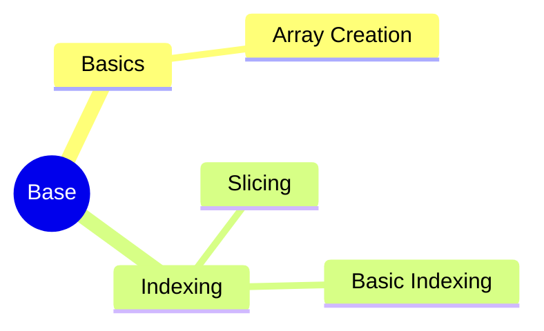

# MindMap


***


***
## Reference

- [♥分布式系统 - 知识体系详解♥ | Java 全栈知识体系](https://pdai.tech/md/arch/arch-z-overview.html)

```mermaid
graph LR
    A[] --> B[]
    B --> C[]
    C --> D[]
    D --> E[]
    E --> F[]
    F --> G[]

	B -.-> |O:N| D
```
