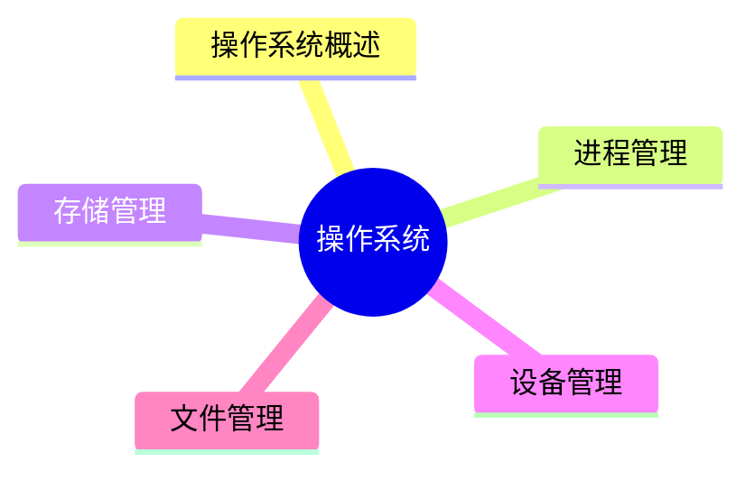
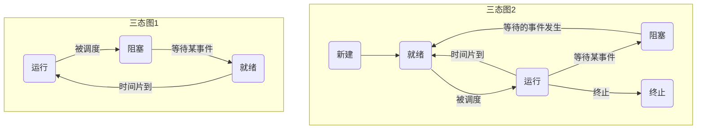

# MindMap


***

## 操作系统概述

> **操作系统定义：** 能有效地组织和管理系统中的各种软/硬件资源，合理地组织计算机系统工作流程，控制程序的执行，并且向用户提供一个良好的工作环境和友好的接口

#### 特征

- 并发性
- 共享性
- 虚拟性
- 不确定性

#### 操作系统的功能

- 进程管理
- 文件管理
- 存储管理
- 作业管理

#### 操作系统的分类

- 分时操作系统
- 实时操作系统
- 分布式操作系统
- 批处理操作系统
- 网络操作系统
- 微型计算机操作系统
- 嵌入式操作系统

#### 嵌入式操作系统主要特点

- 微型化
- 可定制
- 实时性
- 可靠性
- 易移植性

#### 嵌入式系统初始化过程

按照自底向上、从硬件到软件的次序依次为：


- 芯片级是微处理器的初始化
- 板卡级是其他硬件设备初始化
- 系统级初始化就是软件及操作系统初始化

***
## 进程管理 

**进程的组成：** 进程控制块PCB(唯一标志)、程序(描述进程要做什么)、数据(存放进程执行时所需数据)

进程三态之间的转换如下图所示：


- **前趋图：** 用来表示哪些任务可以并行执行，哪些任务之间有顺序关系
- **进程资源图：** 用来表示进程和资源之间的分配和请求关系
- 死锁状态：当一个进程资源图中所有进程都是阻塞节点时，即陷入死锁状态

互斥和同步并非反义词，互斥表示一个资源在同一时间内只能由一个任务单独使用，需要加锁，使用完后解锁才能被其他任务使用


***
## 存储管理 
***
## 设备管理 
***
## 文件管理 
***

## Referecne

```mermaid
graph LR
    A[] --> B[]
    B --> C[]
    C --> D[]
    D --> E[]
    E --> F[]
    F --> G[]

	B -.-> |O:N| D
```
