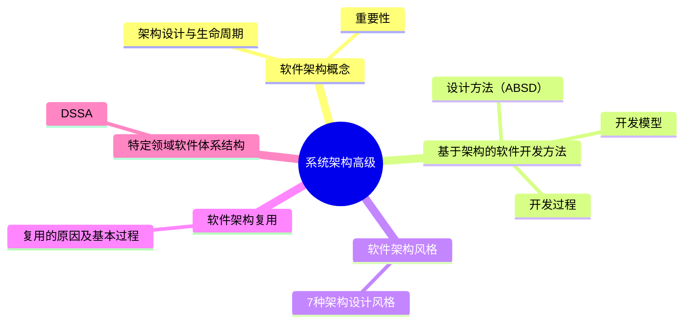
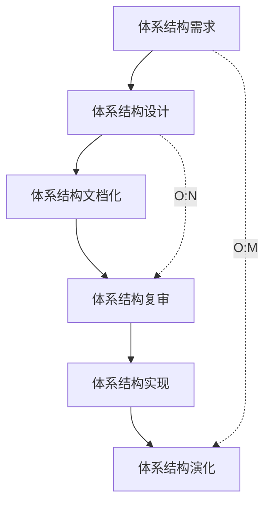

---
aliases:
  - Software Architecture
  - SA
tags:
  - system
  - comput
draft: false
date: 2024-02-18
---
# MindMap

***
##  软件架构概念 

> 软件架构（Software Architecture, SA）或称软件体系结构，是指系统的一个或者多个结构，这些结构包括软件的构件（可能是程序模块、类或者是中间件）、构件的外部可见属性及其之间的相互关系
### 软件架构设计与生命周期 

需求分析阶段：需求关注的是问题空间，架构关注的是解空间，二者主要关注这两个问题
- 如何根据需求模型构建软件架构模型
- 如何保证模型转换的可追踪性
### 软件架构的重要性 

软件架构设计是降低成本、改进质量、按时和按需交付产品的关键因素。软件架构的重要性包括： 

- 使受益人达成一致的目标
- 能够支持计划编制过程
- 能够有效地管理复杂性
- 能够降低维护费用
- 能够支持冲突分析
- …
***
## 基于架构的软件开发方法 

### 体系结构的设计方法概述 

[[基于架构的软件设计（ABSD, Architecture-Based Software Design）]]方法是体系结构驱动的，即指构成体系结构的`商业`、`质量`和`功能需求`的组合驱动的。在基于体系结构的软件设计方法中，采用`视角与视图`来描述软件架构，采用`用例`来描述功能需求，采用`质量场景`来描述质量需求
### 基于体系结构的开发模型

##### 体系结构需求 

> 体系结构的需求工作包括`获取用户需求`和`标识系统中拟用构件`

- 需求获取：质量目标、系统的商业目标和系统开发人员的商业目标
- 标识构件：生成类图→对类进行分组→把类打包成构件
- 架构需求评审的审查：重点包括需求是否真实反映了用户的要求、类的分组是否合理、构件合并是否合理等

###### 需求获取

> **需求获取**是确定和理解不同的项目干系人的需求和约束的过程，需求获取是否科学、准备充分，对获取的结果影响很大

- 用户访谈：具有良好的灵活性，有较宽广的应用范围
- 采样：具有良好的灵活性，有较宽广的应用范围，但存在获取需求时信息量大、记录较为困难、需要足够的领域知识等问题；采样技术不仅可以用于收集数据，还可以用于采集访谈用户或者采集观察用户；采样技术使用了数理统计原理，能减少数据收集的偏差；
- 联合需求计划（Joint Requirement Planning，JRP）：是一个通过高度组织的群体会议来分析企业内的问题并获取需求的过程，它是联合应用开发（Joint Application Development，JAD）的一部分。它主要是为了提高需求获取的效率
##### 体系结构设计过程

> [!info] 设计评审必须邀请独立于系统开发的外部人员
##### 体系结构文档化

体系结构文档化过程的主要输出结果是`体系结构规格说明书`和`测试体系结构需求的质量设计说明书`
##### 体系结构复审 

一个主版本的软件体系结构分析之后，要安排一次由外部人员（用户代表和领域专家）参加的复审

> [!summary] 复审的目的是标识潜在的风险，及早发现体系结构设计中的缺陷和错误
##### 体系结构实现

>[!info] 体系结构的实现过程是以复审后的`文档化体系结构说明书`为基础的

##### 体系结构演化

***
## 软件架构风格 

### 软件架构风格概述 

> 软件体系结构设计的**核心目标**是`重复的体系结构模式（软件复用/重用）`

体系结构风格定义一个系统家族，即一个体系结构定义一个词汇表和一组约束

- 词汇表：包含构件和连接件
- 约束：约束定义构件和连接件的组合方式
### 数据流体系结构风格 

- 批处理体系结构风格
- 管道和过滤器
- 调用/返回体系结构风格
	- 主程序/子程序风格
	- 面向对象体系结构风格
	- 层次型体系结构风格
	- 客户端/服务器体系结构风格
		- 二层 C/S 模式
		- 三层 C/S 模式
	- 浏览器/服务器风格（B/S）
- 以数据为中心的体系结构风格
	- 仓库体系结构风格
	- 黑板体系结构风格
- 虚拟机体系结构风格 
	- 解释器体系结构风格
	- 规则系统体系结构风格
- 独立构件体系结构风格 
	- 进程通信体系结构风格
	- 事件系统体系结构风格
- C2 风格 
	> 通过连接件绑定在一起的按照一组规则运作的并行构件网络

C2风格中的系统组织规则如下:
	
	- 系统中的构件和连接件都有一个顶部和一个底部
	- 构件的顶部应连接到某连接件的底部，构件的底部则应连接到某连接件的顶部，而构件与构件之间的直接连接是不允许的
	- 一个连接件可以和任意数目的其他构件和连接件连接
	- 当两个连接件进行直接连接时，必须由其中一个的底部到另一个的顶部

***
## 软件架构复用

软件架构复用的类型包括`机会复用`和`系统复用`。**机会复用**是在开发过程中，只要发现有可复用的资产就复用。**系统复用**是在开发前进行规划，决定哪些复用。
#### 软件架构复用的原因

减少开发工作、减少开发事件、降低开发成本、提高生产力、提高产品质量，更好的互操作性

#### 件架构复用的基本过程

***
## 特定领域软件体系结构

#### 定义

[[特定领域软件架构（DSSA, Domain Specific Software Achitecture）]]是在一个特定应用领域中为一组应用提供组织结构参考的标准软件体系结构

DSSA 的特征：领域性、普遍性、抽象性、可复用性
#### DSSA 的基本活动 

- 领域分析：通过分析领域中系统的共性需求，建立领域模型
- 领域设计：设计 DSSA，且 DSSA 需要具备领域需求变化的适应性
- 领域实现：获取可重用信息
#### DSSA 的建立过程

> DSSA 的建立过程是并发的、递归的、反复的螺旋模型

- 定义领域范围
- 定义领域特定元素
- 定义领域特定的设计和实现约束
- 定义领域模型和体系结构
- 产生、搜集可重用的单元
#### 参与DSSA的人员

领域专家、领域分析师、领域设计人员和领域实现人员
***
## Reference

- 系统架构工程

