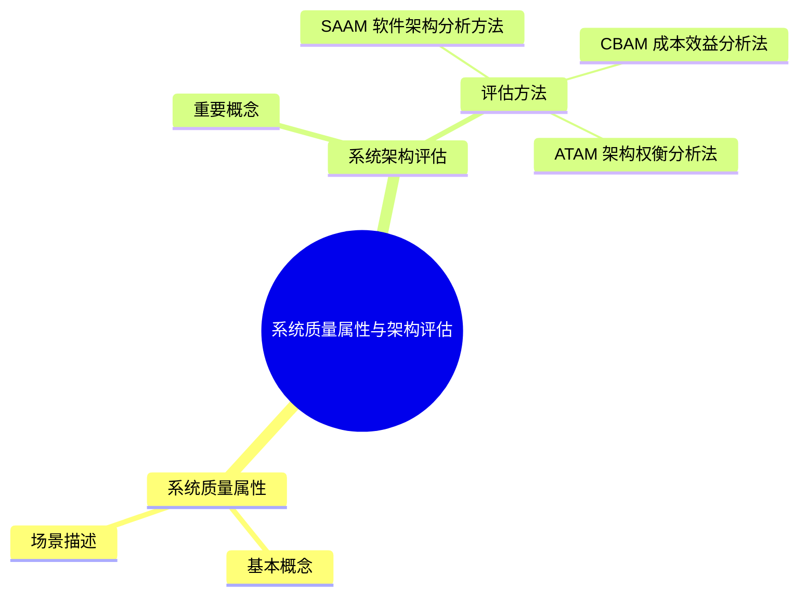

# MindMap



***
## 系统质量

| 子属性  | 作用及要点                                               |     |
| :--- | :-------------------------------------------------- | --- |
| 可扩展性 | 软件因适应新需求或需求变化而增加新功能的能力，也称灵活性                        |     |
| 可重用性 | 指重用软件系统或某一部分的难易程度                                   |     |
| 可测试性 | 对软件测试以证明其满足需求规范的难易程度                                |     |
| 可维护性 | 当需要修改缺陷、增加功能、提高质量属性时，识别修改点并实施修改的难易程度                |     |
| 可移植性 | 将软件系统从一个运行环境转移到另一个不同的运行环境的难易程度                      |     |
| 性能   | 软件系统及时提供相应服务的能力，如速度、吞吐量和容量等                         |     |
| 安全性  | 软件系统同时兼顾向合法用户提供服务，以及组织非授权使用的能力                      |     |
| 可伸缩性 | 当用户数和数据量增加时，软件系统维持高服务质量的能力                          |     |
| 互操作性 | 软件系统与其他系统交换数据和相互调用服务的难易程度                           |     |
| 可靠性  | 软件系统在一定的时间内持续无故障运行的能力                               |     |
| 可用性  | 系统在一定时间内正常工作的时间所占比例                                 |     |
| 鲁棒性  | 软件系统在非正常情况（用户进行非法操作、相关软硬件系统发生故障）下仍正常运行的能力，也称健壮性或容错性 |     |

#### 面向架构评估的质量属性 

- 可用性
- 可靠xing
- 性能
- 安全性
***
## 系统架构评估

#### 系统架构评估重要概念

- 敏感点：实现质量目标时应注意的点，是一个或多个构件的特性
- 权衡点：影响多个质量属性的敏感点
- 风险承担者或利益相关人：影响体系结构或被体系结构影响的群体
- 场景：确定架构质量评估目标的交互机制，一般采用触发机制（教材中解释为“刺激”）、环境和影响三方面来描述。
#### 系统架构评估方法

##### [[软件架构分析方法 ( SAAM, Software Architecture Analysis Method)]]

##### [[架构权衡分析方法（ATAM, Architecture Tradeoff Analysis Method）]]

##### [[成本效益分析法（CBAM, Cost Benefit Analysis Method）]]

***
## Referecne

```mermaid
graph LR
    A[] --> B[]
    B --> C[]
    C --> D[]
    D --> E[]
    E --> F[]
    F --> G[]

	B -.-> |O:N| D
```
