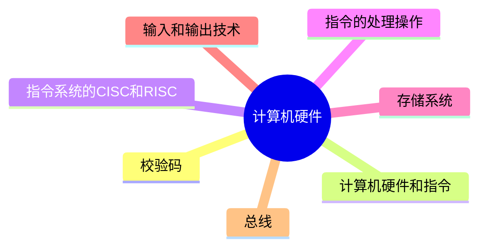

# MindMap


***
## 校验码

**码距：** 就单个编码A:00而言，其码距为1，因为其只需要改变一位就变成另一个编码。在两个编码中，从A码到B码转换所需要改变的位数称为码距，如A:00要转换为B:11，码距为2。一般来说，码距越大，越利于纠错和检错
#### 种类

- 奇偶校验码
- 海明校验码
- 循环冗余（CRC）校验码
	- CRC只能检错，不能纠错

## 计算机硬件和指令

- **计算机的硬件基本系统由五大部分组成：** 运算器、控制器、存储器、输入设备(如鼠标键盘)、输出设备(如显示器)
- CPU：运算器 和 控制器合并称为中央处理单元
- 存储器：
	- 内部存储器(即内存，容量小，速度快，临时存放数据)
	- 外部存储器(即硬盘、光盘等，容量大，速度慢，长期保存数据)
- 鼠标键盘等输入设备都是通过中断的原理来实现控制，点击后触发中断，首先进入中断处理程序
- 主机：CPU(运算器、控制器)、+主存储器
- **CPU：** 由运算器、控制器、寄存器组和内部总线组成。实现程序控制、操作控制、时间控制、数据处理功能
- **运算器的组成：** 
	- **算术逻辑单元ALU(实现对数据的算术和逻辑运算)
	- **累加寄存器AC**(运算结果或源操作数的存放区)
	- 数据缓冲寄存器DR(暂时存放内存的指令或数据)
	- **状态条件寄存器PSW**(保存指令运行结果的条件码内容，如溢出标志等)
- **控制器：** 由`指令寄存器IR(暂存CPU执行指令)`、`程序计数器PC(存放指令执行地址)`、`地址寄存器AR(保存当前CPU所访问的内存地址)`、`指令译码器ID(分析指令操作码)`等组成。控制整个CPU的工作，最为重要
- **计算机指令的组成：** 一条指令由`操作码`和`操作数`两部分组成，操作码决定要完成的操作，操作数指参加运算的数据及其所在的单元地址
- **计算机指令执行过程：** 可分为取指令、分析指令、执行指令三个步骤
- **指令操作数的寻址方式：** 
	- 直接寻址方式
	- 寄存器寻址方式
	- 基址寻址方式
	- 变址寻址方式
	- 间接寻址方式
	- 相对寻址方式
## 指令系统的CISC和RISC

**CISC是复杂指令系统：** 兼容性强，指令繁多、长度可变，由微程序实现

RISC是精简指令系统：指令少，使用频率接近，主要依靠硬件实现(通用寄存器、硬布线逻辑控制)

**流水线执行时间：** 1条指令总执行时间+(总指令条数-1)*流水线周期
## 指令的流水处理操作

**流水线原理**：将指令分成不同段，每段由不同的部分去处理，因此可以产生叠加的效果，所有的部件去处理指令的不同段

**RISC中的流水线技术：** `超流水线(`在每个机器周期内能完成一个甚至两个浮点操作，以时间换空间)、`超标量`(内装多条流水线同时执行多个处理，以空间换时间)、超长指令字VLIW(同时执行多条指令，发挥软件作用)

**流水线周期：** 指令分成不同执行段，其中执行时间最长的段为流水线周期

**流水线吞吐率计算：** 吞吐率即单位时间内执行的指令条数。  
公式：指令条数/流水线执行时间
## 存储系统

> **计算机采用分级存储体系的主要目的：** 是为了解决`存储容量`、`成本`和`速度`之间的矛盾问题

**两级存储映像为：**Cache-主存、主存-辅存(虚拟存储体系)

##### 存储器的分类

- 按存储器所处的位置分：**内存、外存
- 按存储器构成材料：**磁存储器(磁带)、半导体存储器、光存储器(光盘)
- **按存储器访问方式：** 按地址访问、按内容访问(相联存储器)
- **按寻址方式：** 随机存储器(访问任意存储单元所用时间相同)、顺序存储器(只能按顺序访问，如磁带)、直接存储器(二者结合，如磁盘，对于磁道的寻址是随机的，在一个磁道内则是顺序的)
- **高速缓存Cache：** 用来存储当前最活跃的程序和数据，直接与CPU交互，位于CPU和主存之间，容量小，速度为内存的5-10倍，由半导体材料构成。其内容是主存内存的副本拷贝，对于程序来说是透明的

#### 磁盘

**磁盘结构和参数：** 磁盘有正反两个盘面，每个盘面有多个同心圆，每个同心圆是一个磁道，每个同心圆又被划分为多个扇区，数据就被存放在一个个扇区中

存取时间 = 寻道时间 + 等待时间(平均定位时间+转动延迟)

> [!caution] 注意：寻道时间是指磁头移动到磁道所需的时间；等待时间为等待读写的扇区转到磁头下方所用的时间

##### 磁盘调度算法

磁盘数据的读取时间分为 `寻道时间` 和 `旋转时间`，也即先找到对应的磁道，而后再旋转到对应的扇区才能读取数据，其中寻道时间耗时最长，需要重点调度

- 先来先服务FCFS
- 最短寻道时间优先SSTF
- 扫描算法SCAN：又称“电梯算法”
- 单向扫描调度算法CSCAN
## 输入和输出技术

内存与接口地址的编址方法：内存与接口地址独立编址 和 内存与接口地址统一编址

## 总线

> **总线从广义上讲，任何连接两个以上电子元器件的导线都可以称为总线**

分类：内部总线、系统总线、外部总线

- **内部总线：** 内部芯片级别的总线，芯片与处理器之间通信的总线
- **系统总线：** 板级的总线，用于计算机内各部分之间的连接
	- 数据总线(并行数据传输位数)
	- 地址总线(系统可管理的内存空间的大小)
	- 控制总线(传送控制命令)
- **外部总线：** 设备一级的总线，微机和外部设备的总线
	- RS232(串行总线)
	- SCSI(并行总线)
	- USB(通用串行总线，即插即用，支持热插拔)

**并行总线适合**近距离高速**数据传输，串行总线适合**长距离**数据传输，专用总线在设计上可以与连**接设备实现最佳匹配

#### 总线计算

- 总线的时钟周期 = 时钟频率的倒数
- 总线的宽度(传输速率) = 单位时间内传输的数据总量 / 单位时间大小
## Referece

- [2.1.5 校验码（一文带你分析搞懂：奇偶校验码、海明码、CRC码）\_校验码比较-CSDN博客](https://blog.csdn.net/weixin_43914604/article/details/104183321)
- 

```mermaid
graph LR
    A[] --> B[]
    B --> C[]
    C --> D[]
    D --> E[]
    E --> F[]
    F --> G[]

	B -.-> |O:N| D
```
