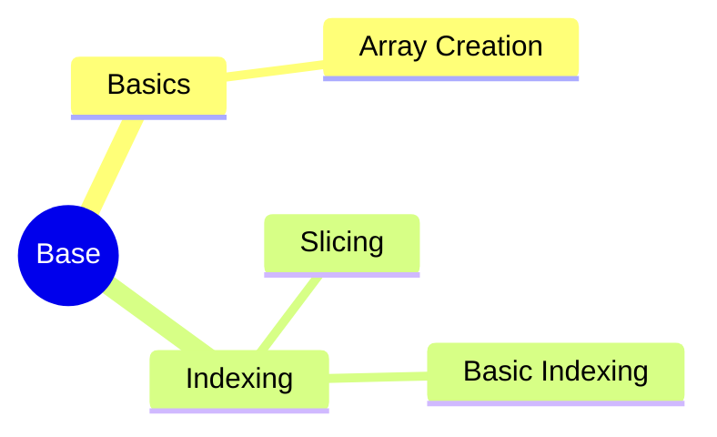

---
aliases:
  - DP
  - Design Patterns
  - 设计模式
tags:
  - system
  - comput
draft: false
date:
---
# MindMap




## 概述

### 定义

> 设计模式（DP, Design Patterns）是指在软件设计中，被反复使用的一种代码设计经验

设计模式的目的：是为了可重用代码，提高代码的可扩展性和可维护性，并且降低代码的耦合度

### 遵守的原则

- 开闭原则
- 里氏替换原则

### 分类

所有模式可以根据其**意图或目的**来分类：

- **创建型模式**：提供创建对象的机制， 增加已有代码的灵活性和可复用性
    
- **结构型模式**：介绍如何将对象和类组装成较大的结构， 并同时保持结构的灵活和高效 
    
- **行为模式**：负责对象间的高效沟通和职责委派

***
## Referecne

- [Design Patterns - Wikipedia](https://en.wikipedia.org/wiki/Design_Patterns)
- 

```mermaid
graph LR
    A[] --> B[]
    B --> C[]
    C --> D[]
    D --> E[]
    E --> F[]
    F --> G[]

	B -.-> |O:N| D
```
