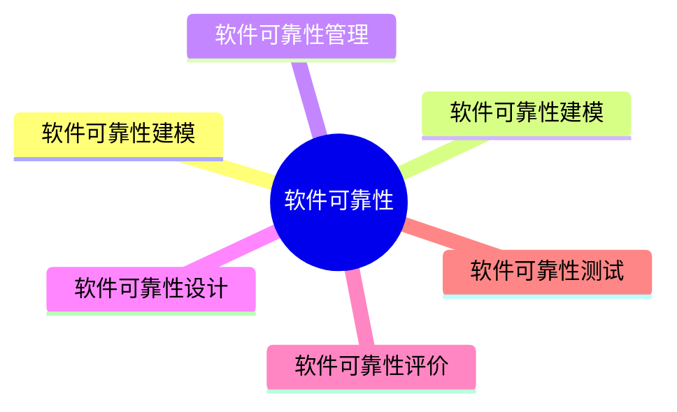

# MindMap



***
## 软件可靠性概念

> 软件可靠性是指在规定的时间内，软件不引起系统失效的概率。该概率是系统输入和系统使用的函数，也是软件中存在的缺陷函数；系统输入将确定是否会遇到已存在的缺陷

### 软件可靠性的定量描述 

> 软件的可靠性是在软件使用条件、在规定时间内、系统的输入/输出、系统使用等变量构成的数学表达式

- 规定时间：自然时间｜运行时间｜执行时间
- 失效概率：出现失效的概率是一个随机函数，成为失效概率
- 可靠度：在软件规定条件下，规定时间内不失效的概率
- 失效强度：单位时间内软件失效的概率
- 失效率
- 平均无效时间

### 可靠性的目标 

软件可靠性是指用户对所使用的软件的性能满意程度的期望。可以用可靠度、平均失效时间和故障强度等来描述

***
## 软件可靠性建模
***
## 软件可靠性管理

软件可靠性管理的各阶段如下：


***
## 软件可靠性设计

#### 软件可靠性设计的技术种类

- 容错设计技术
	- 恢复块设计
	- N 版本程序设计
	- 冗余设计
- 检错技术
- 降低复杂度设计
- 系统配置技术
	- 双机热备技术
		- 采用“心跳”方法保证主系统与备用系统的联系
		- 根据两台服务器的工作方式分为
			- 双机热备模式（一台工作，一台后备）
			- 双机互备模式（两台运行相对独立应用，互为后备）
			- 双机双工模式（两台同时运行相同应用，互为后备）
	- 服务器集群技术
		- 集群内各节点服务器通过内部局域网相互通信，若某节点服务器发生故障，这台服务器运行的应用被另一节点服务器自动接管

***
## 软件可靠性评价

#### 软件可靠性评价概念 

评估和预测软件可靠性过程包括

- 选择可靠性模型
- 收集可靠性数据
- 可靠性评估和预测

#### 如何选择可靠性模型 

- 模型假设的适用性
- 预测的能力与质量
- 模型输出值能否满足可靠性的评价需求
- 模型使用的简便性

#### 可靠性数据的收集 

- 尽可能早地确定可靠性模型
- 数据收集计划要有较强的可操作性
- 重视测试数据的分析和整理
- 充分利用技术手段（数据库技术）来完成分析和统计

#### 软件可靠性的评估和预测

目的：是评估软件系统的可靠性状况和预测将来一段时间的可靠性水平

> [!tip] 评估和预测以软件可靠性模型分析为主，以失效数据的图形分析法和试探性数据分析技术等为辅
***

***
## 软件可靠性测试

### 软件可靠性测试包括的种类

- 可靠性目标的确定
- 运行剖面的开发
- 测试用例的设计
- 测试实施
- 测试结果分析

#### 测试用例的组成

- 测试用例标识
- 被测对象
- 测试环境及条件
- 测试输入
- 操作步骤
- 预期输出
- 判断输出结果是否符合标准
- 测试对象的特殊需求

#### 用时间定义的软件可靠性数据的分类

- 失效时间数据
- 失效间隔时间数据
- 分组时间内的失效数
- 分组时间的累积失效数
***

***
## Referecne

```mermaid
graph LR
    A[] --> B[]
    B --> C[]
    C --> D[]
    D --> E[]
    E --> F[]
    F --> G[]

	B -.-> |O:N| D
```
