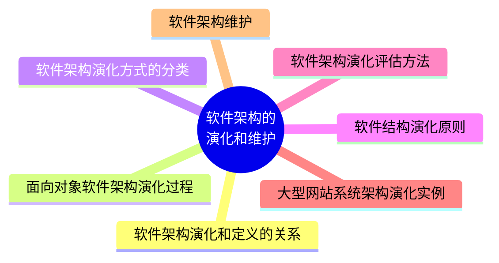

# MindMap




***
## 软件架构演化和定义的关系 

### 演化的重要性

- 保障软件系统具备诸多好的特性
- 有效管控软件系统的整体复杂性和变化性，降低软件检修和修改成本
- 保证软件系统演化的一致性和正确性，增加便捷性

### 演化和定义的关系

- 组件
- 连接件
- 约束

***
## 面向对象软件架构演化过程

- 对象演化
- 消息演化
- 复合片段演化 

***
## 软件架构演化方式的分类 

- 静态演化
- 动态演化

***
## 软件结构演化原则

- 演化成本控制原则
- 进度可控原则
- 主体维持原则
- 系统总体结构优化原则


***
## 软件架构演化评估方法

评估流程：将架构度量应用到演化过程中，通过对演化前后的不同版本的架构分别进行度量，得到度量结果的差值及其变化趋势，并计算架构间质量属性距离，进而对相关质量属性进行评估


***
## 大型网站系统架构演化实例

- 单体架构
- 垂直架构
- 使用缓存改善网站性能
- 使用服务集群改善网站并发能力
- 数据库读写分离
- 使用反向代理和 CDN 加速网站响应
- 使用分布式文件系统和分布式数据库系统
- 使用 NoSQL 和搜索引擎
- 业务拆分
- 分布式服务

***
## 软件架构维护

> [!important] 架构知识=架构设计+架构设计决策

#### 架构可维护性的 6 个度量指标

- 圈复杂度（CNN）
- 扇入扇出度（FFC）
- 模块间耦合度（CBO）
- 模块的响应（RFC）
- 紧内聚度（TCC）
- 松内聚度（LCC）

***
## Referecne

```mermaid
graph LR
    A[] --> B[]
    B --> C[]
    C --> D[]
    D --> E[]
    E --> F[]
    F --> G[]

	B -.-> |O:N| D
```
