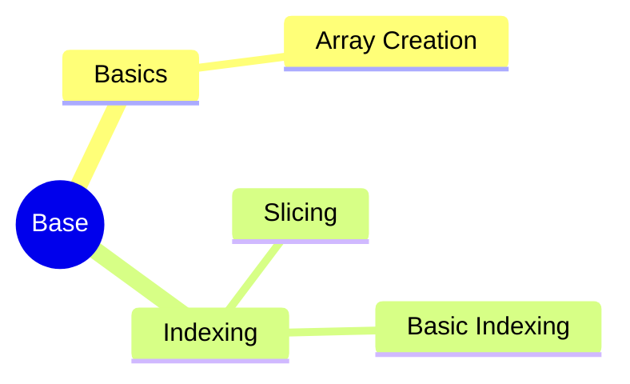

# MindMap

```mermaid
mindmap
  root((Base))
    Basics
      Array Creation
    Indexing
      Basic Indexing
      Slicing
```

***
## Referecne

```mermaid
graph LR
    A[] --> B[]
    B --> C[]
    C --> D[]
    D --> E[]
    E --> F[]
    F --> G[]

	B -.-> |O:N| D
```
